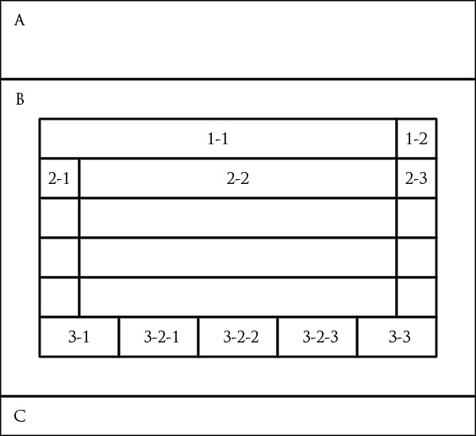

| Title | Author | Date | Description |
|---|---|---|---|
| Psuedocode- Todo | Michael Chinn | 10/19/2021 |

## Story

On initial visit
- User arrives at the page and is presented with an emptyy todo list.
- User has the ability to add new tasks to the list.
- User has the ability to remove tasks from the list.
- User has the ability to mark thetasks as completed.
- User has the ability to remove all completed tasks from from the list.
- User has access to filter tabs.
    - All: Shows all active and completed tasks.
    - Active: Shows only active tasks.
    - Completed: Shows only completed tasks.

## Must Have's

The user must have the ability to.

- Add new tasks
- Remove tasks
- Mark tasks as comepleted
- Store tasks to LocalStorage
- Tabs that filter tasks by
    - All: Shows all tasks
    - Active: Shows all active tasks
    - Completed: Shows all completed tasks
- A button that clears all completed tasks
- Task list must populate from Local storage upon the user coming back to the todo list.

## Model
Tasks
```
tasks.state [
    {
        tab : STRING | default "all" | "active" | "completed",
        clearCompleted : BOOL | default false,
        taskList : [
            {
                id : TIMESTAMP, 
                completed : BOOL | default false,
                removed : BOOL | default false, 
                textValue : STRING default "",
            }
        ]
    }
]

```

## View

### Wireframe
---



---

### Wireframe Breakdown
- A Header .container-fluid text-center
    - .row
        - h1 .col
            - "Task List"
- B Main .container
    - 1 row
        - .col
            - 1-1 Input - text - task
            - 1-2 Button - addTask -method
    - 2 row
        - .col
            - 2-1 checkbox - completedToggle - method
            - 2-2 text - task
            - 2-3 Button - removeTask - method
    - 3 row
        - .col
            - 3-1 text - # of active tasks
            - 3-2-1 Button - "All" - setTab - method
            - 3-2-2 Button - "Active" - setTab - method
            - 3-2-3 Button - "Completed" - setTab - method
            - 3-3 Button - clearCompleted - method
- C Footer .container-fluid
    - .row
        - .col
            - copyright

## Controller

### Methods 

```
addTask(B-1-1){
   tasks.state.taskList.push(setState({
       id : new DateTime(),
       // completed : false,
       // removed : false,
       textValue : B-1-1
    });
    B-1-1.value = "";
    localStorage.setItem("data", tasks.state.taskList)
});

removeTask(id){
    if(tasks.state.taskList[index].id === id){
        tasks.state.tasksList.removed = true;
        localStorage.setItem("data", tasks.state.taskList)
    }
}

markCompleted(id){
    tasks.state.taskList.map(item => {
        item.completed = !item.completed;
    });
    localStorage.setItem("data", tasks.state.taskList);
}

setTab(state){
    tasks.state.tabs.setState(state);
    localStorage.setItem("data," tasks.state.taskList)
}

saveState(){}
loadState(){}
```